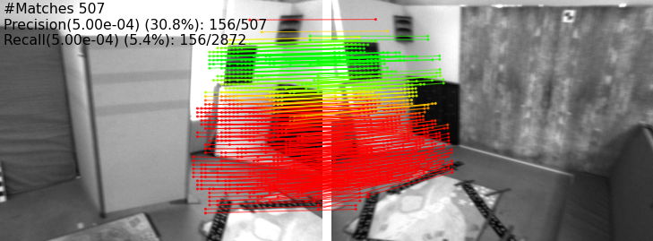
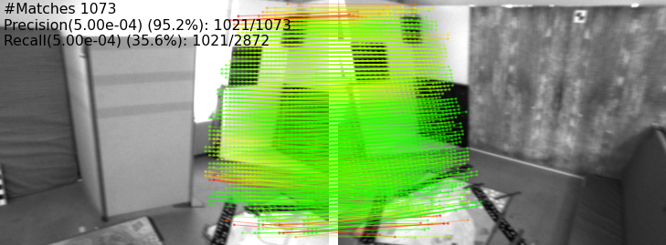

# SCENES: Subpixel Correspondence Estimation With Epipolar Supervision

###  [Paper](https://www.robots.ox.ac.uk/~vgg/publications/2024/Kloepfer24a/kloepfer24a.pdf) | [arXiv](https://arxiv.org/abs/2401.10886)
<br/>




## Code Organisation

### Epipolar Losses

We release implementations of the epipolar regression and the epipolar classification losses described in the paper in `epipolar_losses/`. In principle, these should be able to serve as drop-in replacements for regression and classification losses that use ground-truth correspondences, but depending on the model that is fine-tuned some adjustments to the input / output of the functions may need to be made.

### Scripts

#### Bootstrapping: Estimating Fundamental Matrices

In `scripts/estimate_fundamental_matrices.py` we also provide the skeleton of a script to use a pre-trained pixel correspondence estimator to estimate fundamental matrices which can then be used to fine-tune the model using the bootstrapping approach described in the paper. Since the exact form of this script depends quite heavily on the pre-trained model and dataset used, the end-user will need to implement the `setup_dataset` and `setup_model` functions, and likely will need to adjust the format to save the fundamental matrices in.

#### EuRoC-MAV Data Preparation

In `scripts/eurocmav-preparation-scripts`, we provide the scripts that we used to download and pre-process the EuRoC-MAV dataset and to form image pairs. 

First, download the dataset by running `sh scripts/eurocmav-preparation-scripts/download_eurocmav.sh`. 
Alternatively, you can download the runs directly from [this](https://projects.asl.ethz.ch/datasets/doku.php?id=kmavvisualinertialdatasets) link.

Then, run `sh scripts/eurocmav-preparation-scripts/prepare_eurocmav.sh` to prepare the dataset with the settings used in the paper.

#### EuRoC-MAV Test Script

The script in `scripts/test_eurocmav.py` evaluates a pixel correspondence estimator on the EuRoC-MAV dataset. The `setup_model` function needs to be implemented before usage.
This script contains code to compute the metrics we report in the paper.
It should also be mostly straightforward to adapt this script to compute the same metrics on a different dataset.

## Fine-Tuned Models

Coming Soon! (delayed due to a corrupted disk requiring re-training)

## Citation 

If you find this code useful for your research, please use the following BibTeX entry.

```bibtex
@article{sun2021loftr,
  title={SCENES: Subpixel Correspondence Estimation With Epipolar Supervision},
  author={Kloepfer, Dominik A. and Henriques, Jo\~ao F. and Campbell, Dylan},
  journal={Proceedings of the International Conference on 3D Vision (3DV)},
  year={2024},
  month={mar}
}
```

